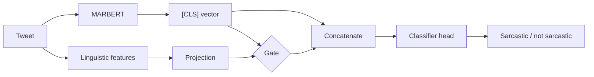

# Arabic Sarcasm Detection with Linguistic Feature Injection

Does adding hand-crafted linguistic features to a fine-tuned Arabic encoder help it detect sarcasm, and which features help?

This project fine-tunes [MARBERT](https://huggingface.co/UBC-NLP/MARBERT) on the [ArSarcasm-v2](https://github.com/iabufarha/ArSarcasm-v2) dataset of Arabic tweets and compares a text-only baseline with two hybrid models that inject extra features into the classifier.

## Configurations

| Configuration | Input to the classifier | Fusion |
|---|---|---|
| **Baseline** | MARBERT `[CLS]` representation | none |
| **Hybrid-Surface** | `[CLS]` + general surface features: character and word counts, counts of `!`, `?`, punctuation and digits, one-hot sentiment and dialect | concatenation |
| **Hybrid-Incongruity** | `[CLS]` + features linked to the expression of attitude: emphasis markers (`!`, `?`, punctuation, ellipses), a lexicon-based polarity score, a flag for divergence between lexical polarity and annotated sentiment, one-hot sentiment and dialect | gated fusion |

In gated fusion, the feature vector is projected to 128 dimensions and multiplied by a learned gate computed from both the text representation and the features, so the model decides per example how much the features should contribute.



## Training protocol

All three configurations share the same protocol, so the feature set and fusion method are the only differences:

- Stratified 10% validation split from the official training set (11,293 train / 1,255 validation / 3,000 test)
- AdamW, learning rate 2e-5, batch size 16, max sequence length 128
- Up to 6 epochs, early stopping on validation macro-F1 (patience 2)
- Class-weighted cross-entropy, since only about 17% of training tweets are sarcastic
- Three random seeds per configuration (42, 123, 2024)
- Model selection on validation only; the test set is evaluated once per run

## Results

Official test set, mean ± standard deviation over three seeds.

| Configuration | Accuracy | Macro F1 | Sarcastic-class F1 |
|---|---|---|---|
| Baseline | 0.766 ± 0.013 | 0.720 ± 0.005 | 0.606 ± 0.016 |
| Hybrid-Surface | **0.783** ± 0.003 | **0.731** ± 0.011 | 0.614 ± 0.023 |
| Hybrid-Incongruity | 0.756 ± 0.006 | 0.724 ± 0.005 | **0.630** ± 0.011 |

- Hybrid-Incongruity gives the highest sarcastic-class F1 (+2.4 points over the baseline) and the lowest variance across seeds on that metric.
- Hybrid-Surface gives the best accuracy and macro-F1, but almost no gain on the sarcastic class itself.
- All gains are small and the standard deviations overlap, so they should be read as a modest effect rather than a clear improvement.

## Limitations

- The sentiment and dialect columns are human annotations that come with ArSarcasm-v2. The hybrid models use them at test time, which a real deployment would not have.
- The polarity lexicon is small and hand-written.
- Feature set and fusion method change together in Hybrid-Incongruity, so their separate contributions are not isolated.
- ArSarcasm-v2 labels reflect perceived sarcasm (third-party annotators), not the authors' intent.

## How to run

Runs on a free Kaggle or Colab GPU (T4). The full experiment (9 runs) takes about 3 to 4 hours.

```bash
pip install -r requirements.txt
python sarcasm_experiment.py
```

The script clones ArSarcasm-v2 automatically, trains all configurations, and writes:

- `results_raw.csv`: test metrics for every run, saved after each run so an interrupted session can resume
- `results_summary.csv`: mean and standard deviation per configuration

## Data

ArSarcasm-v2: Abu Farha, Zaghouani and Magdy (2021), *Overview of the WANLP 2021 Shared Task on Sarcasm and Sentiment Detection in Arabic*. The dataset is not redistributed here; the script downloads it from the official repository.

## Author

Nermeen Rizk
